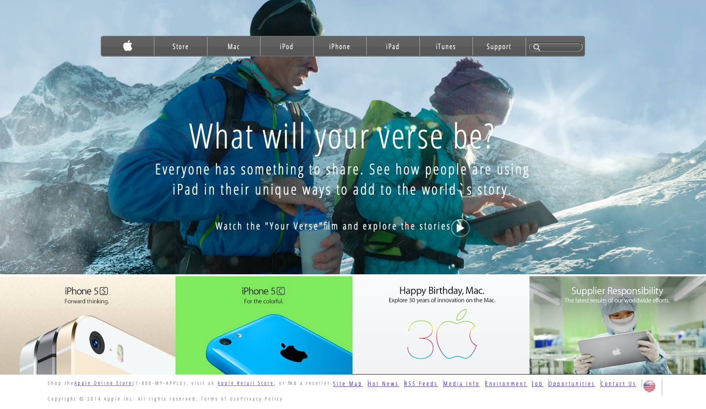

# applePage - Clone
Its a clone of old an old version of the Apple website webpage


- In this project, our assignment consists of making a clone of a old version of Apple page (https://web.archive.org/web/20140301004610/http://www.apple.com/). As usual, we ignored any ads, comments or interactive elements so don’t worry about what happens when you change the page width. The Focus is on making it look similar.



## Built With

- HTML & CSS; 

```Branch is on feature```

## Live Demo

- https://raw.githack.com/brugobi/applePage/feature/index.html

## Author
 
 👤 **Bruna Gobi**

 - Github: [@brugobi](https://github.com/brugobi)
- Twitter: [@BrunaGobi2](https://twitter.com/BrunaGobi2)
- Linkedin: [linkedin](https://www.linkedin.com/in/bruna-gobi-08854760/)
